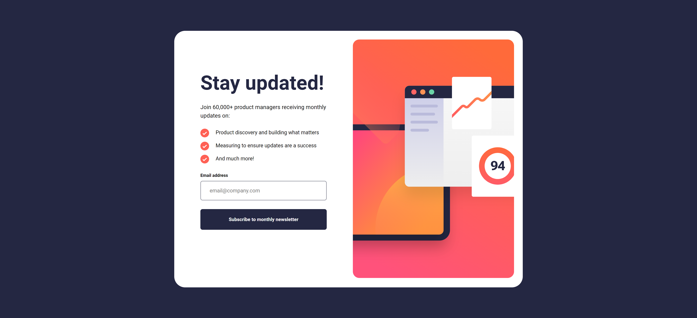
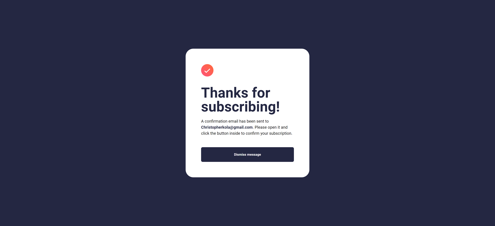
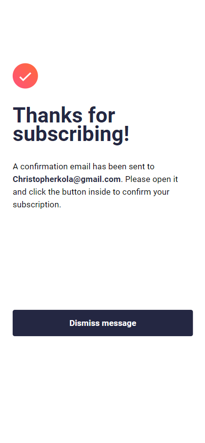

# Frontend Mentor - Newsletter sign-up form with success message solution

This is my solution to the [Newsletter sign-up form with success message challenge on Frontend Mentor](https://www.frontendmentor.io/challenges/newsletter-signup-form-with-success-message-3FC1AZbNrv). Frontend Mentor challenges help you improve your coding skills by building realistic projects.

## Table of contents

- [Overview](#overview)
  - [The challenge](#the-challenge)
  - [Screenshot](#screenshot)
  - [Links](#links)
- [My process](#my-process)
  - [Built with](#built-with)
  - [What I learned](#what-i-learned)
  - [Continued development](#continued-development)
  - [Useful resources](#useful-resources)
- [Author](#author)
- [Acknowledgments](#acknowledgments)

**Note: Delete this note and update the table of contents based on what sections you keep.**

## Overview

### The challenge

Users should be able to:

- Add their email and submit the form
- See a success message with their email after successfully submitting the form
- See form validation messages if:
  - The field is left empty
  - The email address is not formatted correctly
- View the optimal layout for the interface depending on their device's screen size
- See hover and focus states for all interactive elements on the page

### Screenshot

#### Desktop View

#### Mobile View

### Links

- Solution URL: [solution URL here](https://github.com/Ckola99/newsletter-sign-up)
- Live Site URL: [live site URL here](https://ckola99.github.io/newsletter-sign-up/)

## My process

### Built with

- Semantic HTML5 markup
- CSS custom properties
- Flexbox
- CSS Grid
- Mobile-first workflow

### What I learned

I did not learn anything new in this challenge however I reinforced javascript knowledge.

### Continued development

I aim to improve my accessibility and my ability to write clean html.

### Useful resources

- [MDN box shadow](https://developer.mozilla.org/en-US/docs/Web/CSS/box-shadow) - This helped me ensure I got the ox shadow correct.
- [MDN linear-gradient](https://developer.mozilla.org/en-US/docs/Web/CSS/gradient/linear-gradient) - This helped me as a reminder on how to use linear gradient.

## Author

- Frontend Mentor - [@Ckola99](https://www.frontendmentor.io/profile/Ckola99)
- Twitter - [@Kola.Dev](https://www.twitter.com/kolaDev01)
